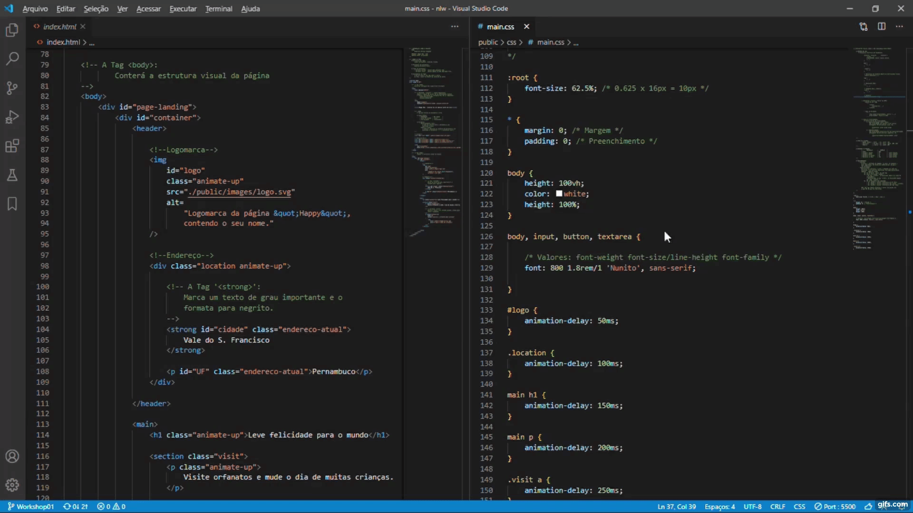

<body>
    <header style="text-align: center">
        

            
            <h1 style="font-weight: bold; font-size: 22px; font-weight: 700; margin: 10px">Happy Web : Projeto &lt;nlw#3&gt;</h1>
        

        <strong>
            Documentação do projeto Happy Web — inspirado na Next
            Level Week 3 🚀
        </strong>
    </header>
    <main style="margin-top: 20px">
        
Mais sobre o projeto em breve!

        <section id="releases" class="releases topic" style="margin-top: 20px">
            <h2 style="font-weight: bold; font-size: 16px">• Andamento do Projeto</h2>
            <section id="workshop1" class="releases subtopic" style="subtopic: 15px">
                <h3 style="font-weight: bold">▸ Workshop #01:</h3>
                
            </section>
        </section>
    </main>
</body>
